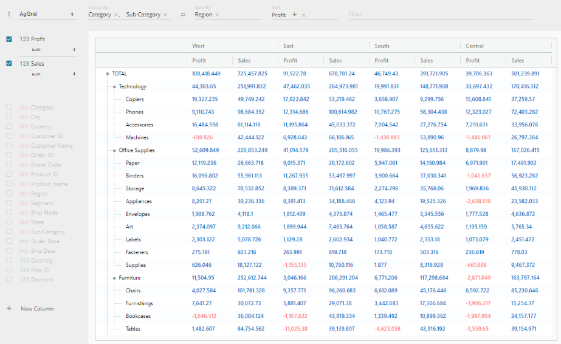

# Perspective Viewer Ag-Grid Plugin

Implements an ag-grid based view for [Perspective](https://github.com/jpmorganchase/perspective).

## Setup

  * Open a console window in the project root and run:

```
  yarn
  yarn start
```

or with npm:

```
  npm install
  npm run start
```

## Example


